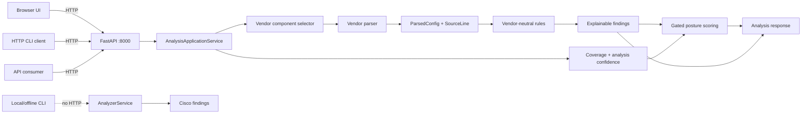

# Switch Security Analyzer

Switch Security Analyzer statically reviews network-switch configurations for
a focused set of defensive weaknesses. It produces explainable findings with
source-line evidence, remediation guidance, and safe configuration examples.

Vendor-specific syntax is normalized before rules run, keeping detection logic
portable and testable. The current implementation supports scoped Cisco IOS /
IOS-XE analysis plus distinct, deliberately limited Aruba AOS-CX and
ArubaOS-Switch first slices, exposed through a REST API, HTTP CLI client,
browser UI, and local/offline CLI.

## Highlights

- Vendor-neutral `ParsedConfig` domain model
- Deterministic, independently tested security rules
- Findings linked to exact `SourceLine` evidence
- Coverage-aware posture scoring with explicit `N/A` gating
- JSON, multipart upload, and batch REST endpoints
- Remote-capable HTTP CLI client and separate offline CLI
- Lightweight browser UI for file upload or pasted configuration
- Single-service, non-root Docker deployment

## Quick start

Start the server and browser UI:

```bash
docker compose up --build
```

Open [http://localhost:8000](http://localhost:8000), or analyze a file from
another terminal:

```bash
python -m src.client.cli \
  --vendor cisco_ios \
  --file switch.cfg
```

Swagger/OpenAPI documentation is available at
[http://localhost:8000/docs](http://localhost:8000/docs).

## Architecture

HTTP interfaces share one application service and one analysis pipeline. The
offline CLI is intentionally separate and invokes the local Cisco analyzer
without a server.



The composition root is
[`AnalysisApplicationService`](src/services/analysis.py); vendor parser,
renderer, and coverage registry selection is centralized in
[`VendorComponentSelector`](src/services/vendor_selection.py).

## Supported platforms

| Vendor identifier | Current scope |
|---|---|
| `cisco_ios` | Main implementation: scoped Cisco IOS / IOS-XE command families and all nine registered rules when applicable context is present |
| `aruba_aos_cx` | Limited AOS-CX 10.12/10.13 slice: `DHCP-001`, `DHCP-002`, `DHCP-003`, `DAI-001`, and `STP-001` |
| `aruba_aos_s` | Limited ArubaOS-Switch / 2930F slice: `DHCP-001`, `DHCP-002`, `DHCP-003`, and `DAI-001` where static evidence permits |

Vendor selection is explicit; syntax auto-detection and cross-vendor fallback
are not implemented. See [Aruba AOS-CX scope](docs/ARUBA_AOS_CX.md),
[ArubaOS-Switch scope](docs/ARUBA_AOS_S.md), and
[multi-vendor architecture](docs/MULTI_VENDOR.md).

## Security checks

| Rule | Check |
|---|---|
| `DHCP-001` | DHCP Snooping globally inactive |
| `DHCP-002` | Access VLAN not covered by DHCP Snooping |
| `DHCP-003` | DHCP Snooping trusted on an access port |
| `DAI-001` | Protected VLAN lacks Dynamic ARP Inspection |
| `IPSG-001` | DHCP endpoint lacks IP Source Guard |
| `PORTSEC-001` | Inconsistent Port Security within an access VLAN |
| `STP-001` | PortFast/edge port lacks effective BPDU Guard |
| `MGMT-001` | VTY lines explicitly permit Telnet |
| `MGMT-002` | Standard HTTP management server explicitly enabled |

## How analysis works

Each vendor parser maps supported syntax into `ParsedConfig`, the normalized
model shared by all rules. `SourceLine` provenance travels with normalized
state, so findings can point back to exact configuration evidence. Rules emit
`RuleEvaluation` metadata as well as findings, distinguishing a clean result
from a control that could not be meaningfully assessed.

Parser Coverage and Analysis Confidence describe analysis completeness, not
device security. A posture score is emitted only when confidence and rule
assessment satisfy the configured eligibility gate; otherwise score and risk
are explicitly `N/A`. Detailed behavior lives in
[Parser Coverage](docs/PARSER_COVERAGE.md),
[Scoring](docs/SCORING.md), and
[Rule authoring](docs/RULE_AUTHORING.md).

## Usage

### Browser UI

Open [http://localhost:8000](http://localhost:8000), select a vendor, then
upload a UTF-8 configuration or paste its text. Both modes use the same
server-side analysis pipeline; configuration content is not persisted.

### HTTP CLI client

The HTTP client uploads a local file to the selected server and only renders
the server-provided result. It does not run analysis locally.

```bash
python -m src.client.cli \
  --server http://SERVER:8000 \
  --vendor aruba_aos_cx \
  --file switch.cfg
```

Use `--stdin` instead of `--file` to pipe configuration text. The default
server is `http://localhost:8000`.

### REST API

```bash
curl --fail --request POST http://127.0.0.1:8000/analyze/file \
  --form 'vendor=cisco_ios' \
  --form 'file=@switch.cfg;type=text/plain'
```

The server provides `GET /health`, `POST /analyze`, `POST /analyze/file`, and
`POST /analyze/batch`. See the [API contract](docs/API.md) and
[batch behavior](docs/BATCH_ANALYSIS.md) for schemas, limits, and errors.

### Local/offline CLI

The original Cisco-only CLI invokes `AnalyzerService` directly and does not
require the HTTP server:

```bash
python -m src.cli samples/cisco/mgmt_002_http_enabled.cfg
```

It reports findings but does not include the API application service's full
coverage and posture envelope.

## Validation

The current automated suite has **441 passing tests** across parsers, rules,
domain models, scoring, APIs, browser contracts, both CLIs, golden outputs,
and cross-vendor semantic parity.

```bash
source .venv/bin/activate
python -m pytest -q
```

| Defensive lab control | Status |
|---|---|
| STP / BPDU Guard | **Validated** |
| Port Security | **Validated** |
| DHCP Snooping | **Investigation — not validated** |
| Dynamic ARP Inspection | **Planned — not executed** |

These are bounded defensive lab results, not platform-wide certifications.
See the [lab validation plan and status](docs/POC/LAB_VALIDATION_PLAN.md),
[STP evidence](docs/POC/STP_BPDU_GUARD_VALIDATION.md), and
[Port Security evidence](docs/POC/PORT_SECURITY_VALIDATION.md).

## Project status and limitations

- **Implemented:** the three documented platform scopes, nine-rule engine,
  coverage/scoring pipeline, API, browser UI, both CLIs, and Docker packaging.
- **Validated:** the automated suite, a bounded external AOS-S configuration
  check, and the two defensive lab controls listed above.
- **Future work — not implemented:** broader vendor/syntax/rule coverage,
  representative-data calibration, production hardening, and additional lab
  validation.

Planned work must not be interpreted as current platform support. Current
parser gaps, rule boundaries, and provisional thresholds are documented in
[Known limitations](docs/KNOWN_LIMITATIONS.md).

## Documentation

- [REST API](docs/API.md) · [Batch analysis](docs/BATCH_ANALYSIS.md)
- [Aruba AOS-CX](docs/ARUBA_AOS_CX.md) ·
  [ArubaOS-Switch](docs/ARUBA_AOS_S.md) ·
  [Multi-vendor architecture](docs/MULTI_VENDOR.md)
- [Parser Coverage](docs/PARSER_COVERAGE.md) · [Scoring](docs/SCORING.md)
- [Rule authoring](docs/RULE_AUTHORING.md) · [Known limitations](docs/KNOWN_LIMITATIONS.md)
- [Demo](docs/DEMO.md) · [Release checklist](docs/RELEASE_CHECKLIST.md)
- [Lab validation](docs/POC/LAB_VALIDATION_PLAN.md) · [Lab platform ADR](docs/ADR/ADR-005-lab-platform.md)
